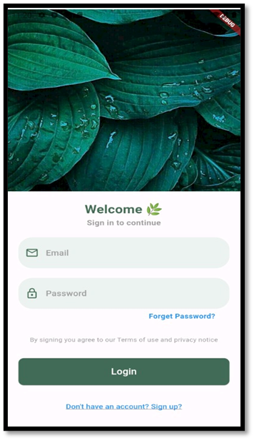
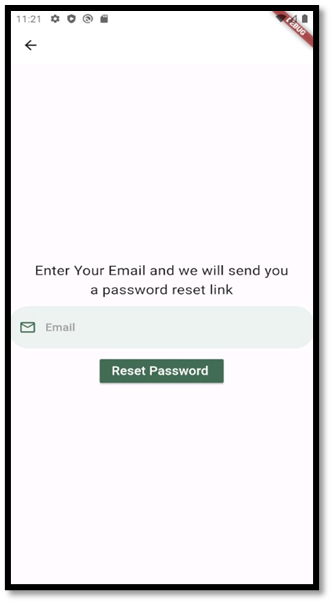
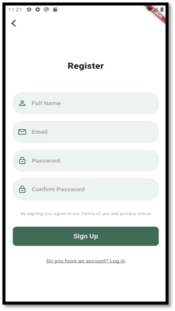
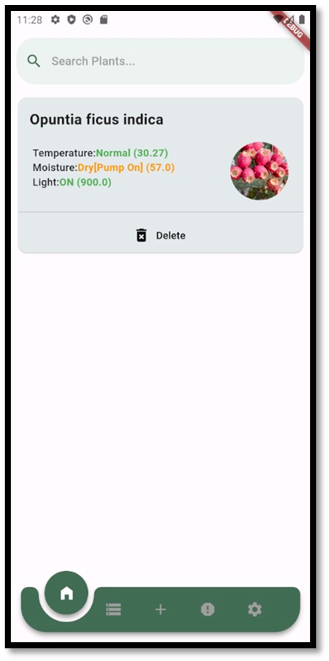
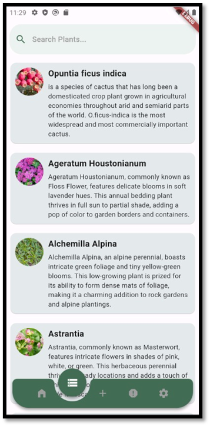
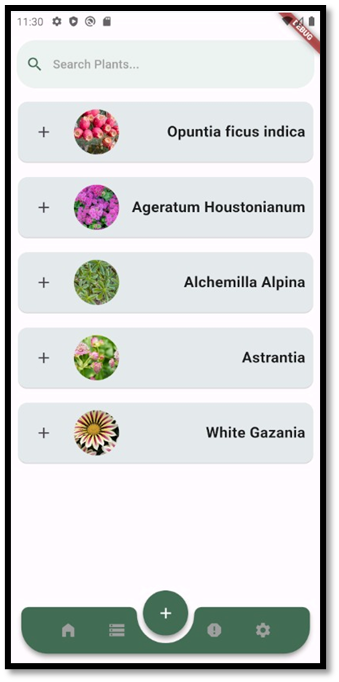
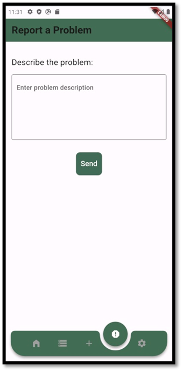
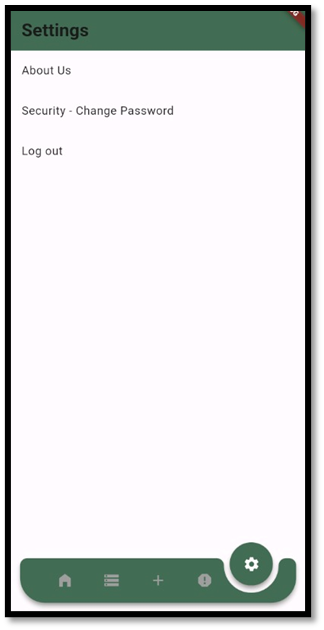

# Plant Care Application User Interface

## Login Page

The user can use this interface to input their email address and password in the two fields, then click "Login." If the user's information is stored in the database, they will be redirected to the home interface. In the event that it is not registered, the user will see an error message. Additionally, the interface allows users to change their passwords as soon as they forget them by clicking the "forget password" button, which takes them to the "change password" page. By selecting "sign up," the user can also access the interface’s new account creation interface.

## Change Password Page

This interface allows the user to change the password by clearing their email and then creating a new password.

## Sign Up Page

This interface allows the user to create a new account by entering the data into the boxes, which includes full name, email, password, password confirmation and then pressing sign up. In this case, the system adds this data to the system database, and also provides access to the login interface.

## Home Page

This interface shows all the data from the temperature, moisture of the soil, the intensity of the light and the satisfactory condition of the plant that belongs to each park owned by the user. This interface allows the possibility of searching for a specific garden from the gardens displayed to the user, and the interface allows the movement to other interfaces.

## Information Page

This interface shows all the data and information about plants in terms of how to take care of them and provide all their needs for growth, and allows the possibility of searching for a specific plant, and allows the interface to move to other interfaces.

## Add Plant Page

This interface enables the identification of a specific plant to add a new garden containing this plant in the home interface and display its own data. It allows the possibility of searching for a particular plant to add it, and allows the interface to move to other interfaces.

## Report Page

This interface allows sending a report on a problem, and allows the interface to move to other interfaces.

## Setting Page

This interface allows you to move to many interfaces and includes moving to the about us interface and password change interface, and allows you to log out.
